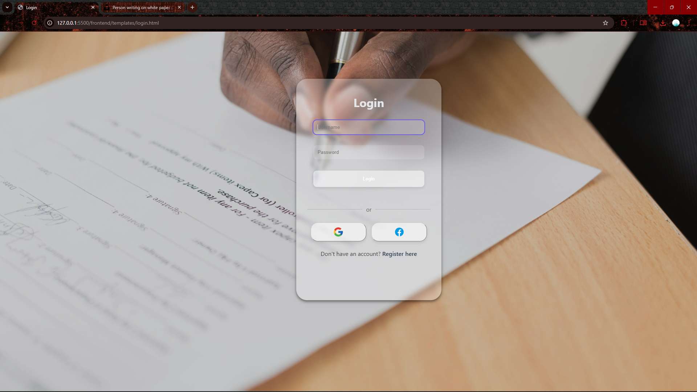
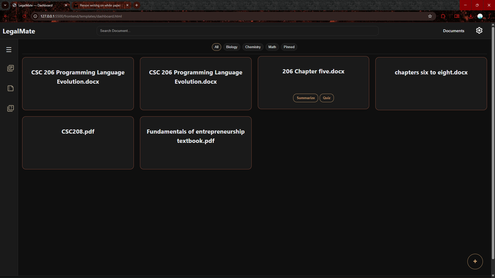
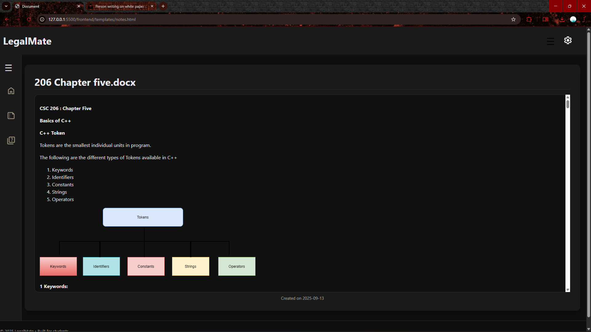
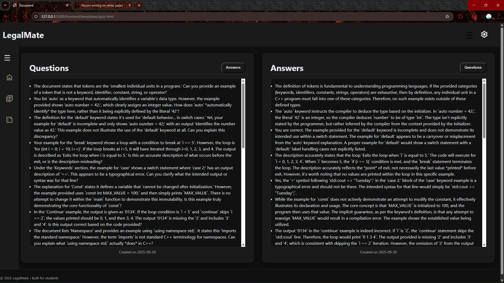

# 🖥️ Frontend – LegalMate

This is the **frontend interface** for LegalMate.  
Built with **HTML, CSS, and Vanilla JavaScript**.  

It connects to the FastAPI backend to allow users to:
- Register / Login
- Upload legal documents
- Summarize or generate quizzes
- View and manage documents in the dashboard
- Download results as PDF
- Adjust account settings

---

## 📂 Pages

- `register.html` → User registration page  
- `login.html` → User login page  
- `dashboard.html` → User dashboard (list of documents, actions)  
- `notes.html` → Open a specific note, summarize, generate quiz, delete  
- `settings.html` → User settings page  

---

## 🎨 Styles

The CSS files are split for clarity:  
- `login.css` → Styling for login/register pages  
- `dashboard.css` → Styling for dashboard  
- `note.css` → Styling for notes page  
- `color.css` → Centralized color definitions (used across app)  
- `popup_settings.css` → Styling for popup_settings page 
- `settings.css` → Styling for settings page  

---

## ⚙️ JavaScript

The JavaScript is split into two files:  
- `api.js` → Contains all **fetch functions** that talk to the backend (login, register, upload, summarize, quiz, delete, etc.)  
- `app.js` → Main script where event listeners are defined and fetch functions are **called**  

---

## 🔗 Connecting to Backend

The frontend uses `fetch()` to talk to the FastAPI backend.  
By default, it expects the backend at:
http://127.0.0.1:8000

```mathematica

If your backend runs elsewhere, update the base URL inside: frontend/api.js
```

---
## 🛠️ How to Run

```yaml
Simply open the following file in your browser: frontend/login.html

From there:
1. Register a new account  
2. Log in  
3. Access the dashboard  
4. Upload documents → Summarize → Generate quizzes → Download  
5. Manage account via Settings page  

```

---

## 📸 Screenshots

Screenshots of the UI are stored in the   folder.  

Example:  
  
  
  
  

---

## 📝 Notes

- MVP frontend is **static HTML/JS**.  
- For scaling to mobile/web apps, this can later be migrated to **React** or **React Native**.  


